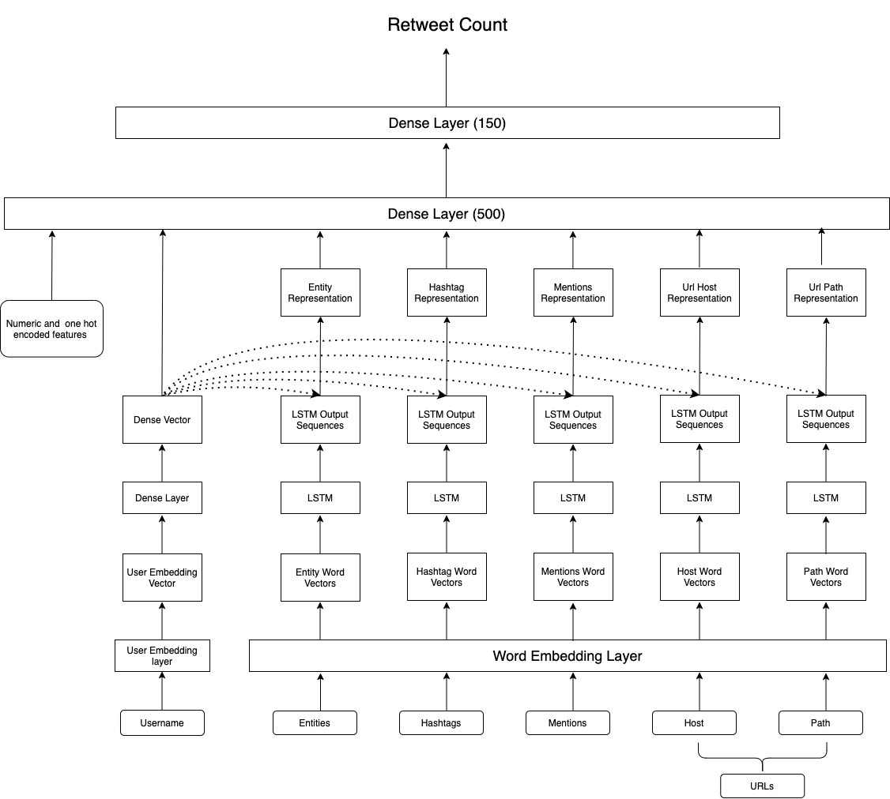

# CIKM2020
 This is the 1st Place solution of CIKM2020 Analyticup COVID19 Retweet Prediction Challenge - https://competitions.codalab.org/competitions/25276.
 
# MODEL ARCHITECTURE:



# HOW TO RUN

``` sh
python main.py [data_path] [external_data_indicator(1/0)] [path to external data] [path to the pretrained embedding file] [pretrained embedding name] [embedding size] [path to save model] [path to save test result] [use _CNN(1/0)]
```

Here is an example

``` sh
python main.py /projects/CIKM/ 1 /projects/CIKM/ /projects/CIKM/embeddings/glove.6B.300d.txt glove.840B.300d.txt 300 ./lstm_glove_model.ckpt ./test.predict test.data 0
```

Train data, train labels and text data should be placed in "data_path". 0 in "external_data_indicator" represents that there is no data present in the external data path directory. If use_CNN=0, LSTM is used extrat features from word vectors.


External dataset can be downloaded from the TweetsKB dataset provided here : https://data.gesis.org/tweetskb/. For this exercise ,all tweets from the months of April(month_2020-04.n3.gz) and March 2020(month_2020-03.n3.gz) were used. 

Pretrained word vectors tried in this challenge are fasttext, glove840, glovetwitter(200d), fasttextwiki and LexVec. You can use any of these pretrained vectors to run the code. 


# DEPENDENCIES
Python 3.6 <br /> 
Tensorflow 2.2.0
